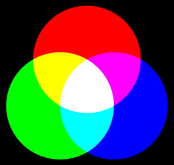
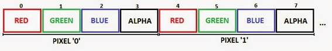
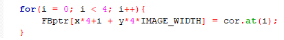
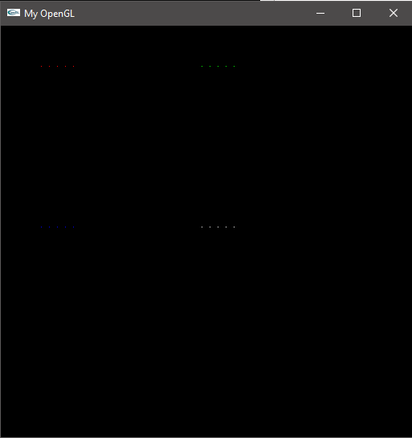
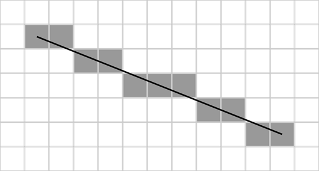
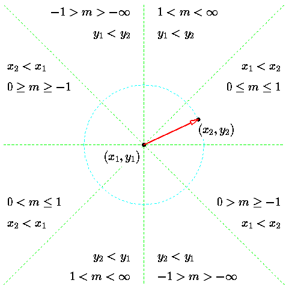
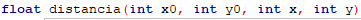
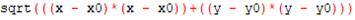

# Projetos ICG

Aqui irão conter os projetos desenvolvidos na disciplina de Introdução à Computação Gráfica.  Essa disciplina faz parte do curso de Ciências da Computação, ministrado na Universidade Federal da Paraíba (UFPB).

*Here will contain the projects developed in the subject of Introduction to Computer Graphics. This subject belongs to the course of Computer Science, ministered in the Universidade Federal da Paraíba (UFPB).*

--- 

## Menu

* [Introduction](#introduction)
* [Points Rasterization](#points-rasterization)
* [Lines Rasterization](#lines-rasterization)
* [Drawing Triangles](#drawing-triangles)
* [Conclusions](#conclusions)
* [References](#references)

---

### Introduction

Este é o primeiro projeto da disciplina Introdução à Computação Gráfica, ministrada pelo professor Cristian Pagot. O projeto consiste em implementar funções para desenhar em memória de vídeo um pixel, uma linha e um triângulo utilizando o algoritmo de Bresenham.

---

### Points Rasterization

Primeiramente devemos entender o que é rasterização.  Rasterização é a tarefa de converter uma imagem vetorial(curvas funcionais) em uma imagem raster(pixels ou pontos). Agora que já sabemos o que é rasterizar vamos entender o que é um pixel. Um pixel é o menor elemento em um dispositivo de exibição, um monitor por exemplo, ao qual é possível atribuir-se uma cor. Neste projeto utilizaremos o formato RGBA para atribuir cor aos pixels.

Cada pixel contém suas informações RGBA que são armazenadas em 4 bytes. Cada byte contém uma das cores primarias que são RED(vermelho), GREEN(verde), BLUE(azul), ALPHA(transparente),  com esse sistema é possível criar mais de 16 milhões diferentes combinações de tons.

	 
	
	<h5 align="center">Figure 1 - Representação do sistema RGB</h5>
	 

Agora vamos observar o cabeçalho da função putPixel: 

	 
	
	<h5 align="center">Figure 2 - Código da função putPixel</h5>
	 

Ele recebe como parâmetros a posição x, a posição y e um vetor que contém a cor.  Como cada pixel ocupa 4 bytes é necessário multiplicar a posição x por 4, além disso, somamos a posição x com o valor de i para percorremos todos os bytes de cor e atribuir-lhes seus valores RGBA.

	 
	
	<h5 align="center">Figure 3 - Ocupacao do pixel na memoria</h5>
	 

Porém isso só funciona para a posição x, para acharmos a posição y de um pixel é necessário utilizarmos a seguinte função:

    <b> F(x,y) = 4*(x + y*IMAGE_WIDTH) </b>

Após implementarmos essa função o código fica assim:

	 
	
	<h5 align="center">Figure 4 - Código 2</h5>
	 

            
Os resultados são os seguintes:
	 

	 
	
	<h5 align="center">Figure 5 - Resultado do código 2</h5>
	 

Nessa imagem a função foi chamada várias vezes para que os pixels fiquem mais perceptíveis.

---

### Lines Rasterization

Para rasterizar linhas utilizaremos o algoritmo de Bresenham.  O algoritmo de Bresenham, também conhecido como algoritmo do ponto médio, é um algoritmo criado para desenhar linhas em dispositivos matriciais, como por exemplo, um monitor. Ele é considerado leve por utilizar apenas operações de adição, subtração e lógica binária.

Agora vamos verificar o cabeçalho da função drawLine:

	 
	
	<h5 align="center">Figure 6 - Função drawLine</h5>
	 

 
Essa função recebe os parâmetros:    
-x0 -> ponto x inicial da reta.  
-y0 -> ponto y inicial da reta.  
-x1 -> ponto x final da reta.  
-y1 -> ponto y final da reta.  
-corI -> vetor que armazena a cor do vértice inicial da reta.  
	
Devemos entender como o algoritmo de Bresenham funciona, a imagem abaixo nos ajudará com isso:

	 
	
	<h5 align="center">Figure 7 - Pixels ativados pelo algoritmo de Bresenham</h5>
	 

Como podemos ver na imagem o algoritmo escolhe o pixel mais próximo do ponto médio da reta quando ele passa por 2 pixels diferentes. Para entendermos como essa escolha é feita primeiro precisamos olhar para a equação reduzida da reta:

    <b> Y = m*X + C** </b> 

                
Onde X e Y são as coordenadas do ponto que pertencem a reta e "m" é o coeficiente angular da reta que é dado por:

    <b> m = (xf - xi)/(yf - yi) </b>

Substituindo a variação em x por dx e a variação em y por dy temos:

    <b> m = dy/dx </b>

 

e C é o coeficiente linear.

Sabendo disto podemos então declarar a função:

    <b> F(X, Y) = X*(dy/dx) + c – Y = 0 </b>

Para simplificar podemos multiplicar todos os valores da equação por dx:

    <b> F(X, Y) = X*dy + c*dx – Y*dx </b>

Com isso podemos criar uma “variável de decisão”, vamos chamá-la de d. A variável d pode ser escrita como:				

    <b> d = F(M) = (x + 1)*dy – dx*(y + 1/2) + c*dx </b>

Com esta função sabemos que um ponto que esteja na reta terá valor 0, se o valor for positivo sabemos que o próximo ponto que deve ser acendido será o ponto abaixo da reta, em outras palavras, o ponto (X + 1, Y). Caso o valor seja negativo podemos afirmar que o próximo ponto que deve ser acendido será o ponto acima da reta, ou seja, o ponto (X + 1, Y + 1).

Com todos esses cálculos estamos quase prontos para começar a desenhar linha com Bresenham, falta apenas descobrirmos o d inicial.

    <b> 
        di = F(x + 1, y + 1/2)  
        di = (x + 1)*dy – dx*(y + 1/2) + c*dx  
        di = x*dy + dy – y*dx - dx/2 + c*dx  
        di = x*dy – y*dx + c*dx + dy – dx/2  
        di = F(X, Y) + dy – dx/2  
        di = dy – dx/2  
        di = 2dy – dx  
    </b>

Chegamos no valor de "di" quando estivermos no começo da reta, pois apenas quando o ponto fizer parte da reta teremos que F(X, Y) = 0. Agora teremos que descobrir os valores para quando o ponto não estiver na reta.

Quando o ponto estiver abaixo da reta:

    <b> 
        Dold = (x + 1)*dy – dx*(y + 1/2) + c*dx  
        Dold = 2dy - dx  
        Dnew = (x + 2)*dy – dx*(y + 1/2) + c*dx  
        Dnew = 4dy – dx  
    </b>

Logo, Podemos concluir que:

    <b> 
        Dnew = Dold + 2dy  
    </b>

Quando o ponto estive acima da reta:

    <b> 
        Dold = 2dy - dx  
        Dnew = (x + 2)*dy – dx*(y + 3/2) + c*dx  
        Dnew = 2dy – 2dx  
    </b>

Logo, Podemos concluir que:

    <b> 
        Dnew = Dold + 2(dy - dx)  
    </b>

Além disso, também devemos incrementar a variável x quando d < 0  e incrementar x e y quando d >= 0.
Finalmente, após transformer tudo isso em linhas de código temos o seguinte resultado:

	 
	
	<h5 align="center">Figure 8 - Resultado do uso do algoritmo de Bresenham</h5>
	 

       
Podemos perceber que conseguimos rasterizar uma linha utilizando o algoritmo de Bresenham, mas o algoritmo está funcionando apenas de 0° a 45°, ou seja, está funcionando apenas no primeiro octante e agora devemos fazer com que ele funcione em todos. Observe a imagem abaixo para uma representação melhor dos octantes:
      

	 
	
	<h5 align="center">Figure 9 - Octantes do sistema cartesiano</h5>
	 

		
              
Graças a imagem é possível perceber que quando dx for menor que 0 só teremos que trocar as posições iniciais pelas finais e vice-versa, já que retas representadas no primeiro, segundo, sétimo e oitavo quadrantes podem ser representadas no quinto, sexto, terceiro, quarto respectivamente.
Já temos o algoritmo pronto para o oitavo octante  agora devemos calcular o di e dnew para o primeiro, segundo e sétimo octantes.

Utilizando o gráfico podemos perceber que no primeiro octante o dx vai ser maior que 0 e o dy menor. Com estas informações podemos calcular:

    <b> 
        di = (x + 1)*dy – dx*(y – 1/2) + c*dx  
        di = 2dy + dx  
    </b>

Quando o ponto estiver abaixo da reta:

    <b> 
        Dnew = (x + 2)*dy – dx*(y - 1/2) + c*dx  
        Dnew = 4dy +dx  
    </b>

Logo, podemos concluir que:

    <b> 
        Dnew = di + 2dy  
    </b>

Quando o ponto estiver acima da reta:

    <b> 
        Dnew = (x + 2)*dy – (y + 1/2)*dx + c*dx  
        Dnew = 4dy – dx  
    </b>

Logo, Podemos concluir que:

    <b> 
        Dnew = di +2*(dy - dx)  
    </b>

Além disso, também é necessário incrementar x quando d < 0 e incrementar x e y quando d >= 0.

Depois de fazer os mesmos cálculos aos 2 octantes restantes temos o seguinte resultado:

	 
	
	<h5 align="center">Figure 10 - Linhas em vários quadrantes</h5>
	 

Como podemos ver agora é possível desenhar linhas em todos os quadrantes.

---

### Linear Interpolation

Agora que já temos o algoritmo de Brasenham pronto temos que fazer um algoritmo que faca a interpole as cores dos vértices da linha. Para isso criaremos duas novas funções.

A primeira será uma que retorna o tamanho da linha, vamos chama-la de distancia. O cabeçalho dessa função é esse:

	 
	
	<h5 align="center">Figure 11 - Tamanho da linha (distância)</h5>
	 

Ela recebe a posição inicial e final dos vértices e utilizando Pitágoras descobrimos seu tamanho, o trecho de código abaixo mostra como é feito o calculo:
                         

	 
	
	<h5 align="center">Figure 12 - Pitágoras</h5>
	 

A segunda função é a colorInterpolation, mas antes de mostrar o cabeçalho desta função vamos falar das mudanças feitas no código atual.  A primeira mudança foi dentro do função drawLine, o seu cabeçalho foi mudado para:

	 
	
	<h5 align="center">Figure 12 - Pitágoras</h5>
	 

Foi acrescentada uma nova variável chamada corF, essa variável representa a cor que terá o segundo vértice da reta. Também ocorreram as seguintas mudanças dentro do corpo da função drawLine:

/**        (imagem)        **/

Os novos vetores RGBAi e RGBAf servem para guardar a cor inicial e final da reta, essas variáveis serão usadas na função de interpolação de cores. O vetor RGBA é a “cor final” é nesse vetor onde vai ficar a cor que o pixel irá exibir. Também foram acrescentadas as variáveis distReta, distPonto e p. distReta é a variável que armazena o tamanho da reta. distPonto é a variável que armazena a distancia do ponto atual até o final da reta. p é a razão entre distPonto e distReta, ela será usada para calcular a porcentagem de cor que deverá ser diminuída ou aumentada dependendo da distancia da reta. O maior valor que p consegue ter é 1 e o menor é 0.

A função colorInterpolation é essa:

/**        (imagem)        **/

Essa função é dividida em duas partes. A primeira parte é o decremento de cor, ela verifica qual é a cor inicial por meio da variável RGBAi e atribui a variável RGBA o valor da cor inicial multiplicado por p. A segunda parte é o incremento de cor, ela verifica qual é a cor final por meio da variável RGBAf e atribui a variável RGBA o valor da cor final multiplicado por (1-p).
A função colorInterpolation deve ser chamada toda vez antes da função putPixel.

O resultado é o seguinte:

/**        (imagem)        **/

---

### Drawing Triangles

Nossa próxima tarefa é desenhar um triângulo, para fazer isso basta criar uma função chamada drawTriangle cujo cabeçalho: 

/**        (imagem)        **/

Essa função recebe os 3 vertices do triangulo e as cores de cada vértice. Para conseguir desenhar um triângulo é bem simples, basta chamar a função drawLine 3 vezes com um vértice ligando ao outro.

Os resultados são os seguintes:

/**        (imagem)        **/

---

### Conclusions

Chegamos a conclusão que o algoritmo de Bresenham é realmente muito efetivo para desenhar linhas, como um todo achamos que os resultados foram satisfatórios. O maior desafio encontrado durante o desenvolvimento do projeto foi na função de interpolação de cores, encontramos um bug que fazia com que a cor inicial ficasse transparente. Esse problema foi resolvido após adicionar os vetores RGBAi e RGBAf para verificar se a cor que estava sendo alterada era a cor inicial ou final.

---

### References

https://en.wikipedia.org/wiki/Bresenham%27s_line_algorithm
https://www.cs.helsinki.fi/group/goa/mallinnus/lines/bresenh.html
https://pt.wikipedia.org/wiki/Rasteriza%C3%A7%C3%A3o
https://pt.wikipedia.org/wiki/RGB
https://brasilescola.uol.com.br/matematica/equacao-reduzida-reta.htm  
Notas de aula do professor(slides).
	
